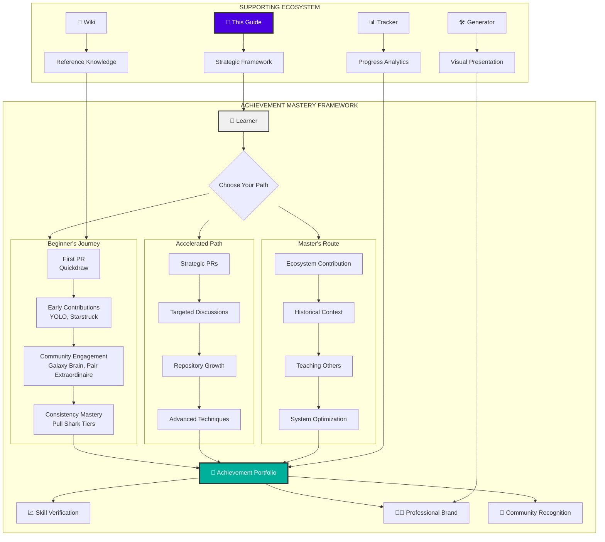
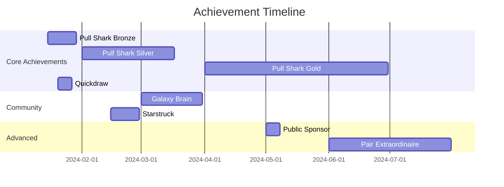
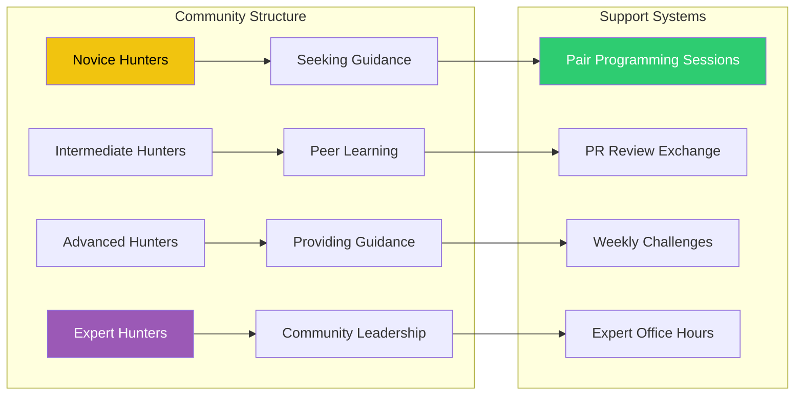

# 🧭 GitHub Achievements Guide: The Mastery Navigator

<div align="center">


# 🌟 **The Strategic Playbook for GitHub Achievement Mastery**

### **From First Commit to Legendary Status: Your Complete Path to GitHub Greatness**

[](https://github.com/AshrafMorningstar/GitHub-Achievements-Guide/wiki)
[](https://ashrafmorningstar.github.io/GitHub-Achievements-Guide/)
[](COMMUNITY.md)


</div>

## 🧠 Introduction: The Philosophy of Achievement Mastery

Welcome to the **GitHub Achievements Guide**, the definitive strategic framework for understanding, earning, and mastering every achievement in GitHub's recognition ecosystem. This isn't just a list—it's a **comprehensive learning system**, a **strategic playbook**, and a **mastery pathway** designed to transform your GitHub journey from passive participation to intentional excellence.

### 🎯 **The Core Philosophy**

> "Achievements are not just badges; they're **milestones in your development journey**, **proof of community contribution**, and **markers of professional growth**. Each badge tells a story of skills learned, challenges overcome, and value created."

## 🏗️ The Complete Achievement Ecosystem Architecture



## 📚 The Mastery Learning System

### 🎓 **Levels of Achievement Mastery**

| Level | Focus | Time Investment | Key Outcomes |
|-------|-------|-----------------|--------------|
| **Apprentice** 🟢 | Understanding basics, first achievements | 1-2 weeks | First PR merged, Quickdraw earned |
| **Journeyman** 🔵 | Consistent contribution, community engagement | 1-3 months | Multiple achievement types, tier progression |
| **Expert** 🟣 | Strategic growth, teaching others | 3-6 months | Gold-tier achievements, community recognition |
| **Master** 🟡 | Ecosystem contribution, optimization | 6-12 months | Complete collection, historical achievements |
| **Legend** 🔴 | Redefining possibilities, legacy building | 1+ years | Influencing GitHub's achievement system |

### 🌳 **The Achievement Skill Tree**

```mermaid
graph TB
    ROOT[GitHub Achievements Mastery] --> CORE[Core Competencies]
    
    CORE --> COLLAB[Collaboration Skills]
    COLLAB --> PS[Pull Shark<br/>Bronze → Gold]
    COLLAB --> PE[Pair Extraordinaire]
    
    CORE --> RESP[Responsiveness]
    RESP --> QD[Quickdraw]
    RESP --> ARD[Answered Discussions]
    
    CORE --> QUALITY[Quality Focus]
    QUALITY --> YOLO[YOLO: Clean PRs]
    QUALITY --> DIV[Diverse Contributions]
    
    CORE --> COMMUNITY[Community Building]
    COMMUNITY --> GB[Galaxy Brain]
    COMMUNITY --> SS[Starstruck]
    
    CORE --> CONSISTENCY[Consistency]
    CONSISTENCY --> PS_TIERS[Tier Progression]
    CONSISTENCY --> MAINTAINER[Maintainer Status]
    
    ROOT --> SPECIALIZED[Specialized Paths]
    
    SPECIALIZED --> OSS[Open Source Leader]
    OSS --> SPONSOR[Public Sponsor]
    OSS --> ADVISOR[Security Advisory]
    
    SPECIALIZED --> EDU[Education & Mentorship]
    EDU --> CAMPUS[Campus Expert]
    EDU --> MENTOR[Community Mentor]
    
    SPECIALIZED --> HISTORICAL[Historical Mastery]
    HISTORICAL --> ARCTIC[Arctic Code Vault*]
    HISTORICAL --> MARS[Mars 2020*]
    
    style ROOT fill:#4a00e0,color:#fff
    style PS fill:#0e8a16,color:#fff
    style GB fill:#6f42c1,color:#fff
    style ARCTIC fill:#6a737d,color:#fff
```



## 🏆 Complete Achievement Catalog with Mastery Paths

### 🔥 **Core Achievements (Active & Earnable)**

| Achievement | Mastery Level | Strategic Approach | Time Estimate | Pro Tips |
|-------------|---------------|-------------------|---------------|----------|
| **🦈 Pull Shark** | Apprentice → Expert | Focus on quality PRs in popular repos | 2 days → 6 months | Start with documentation fixes, then feature additions |
| **⚡ Quickdraw** | Apprentice | Monitor issue trackers actively | 1-2 weeks | Set up notifications, focus on repos you know well |
| **🌟 Starstruck** | Journeyman | Create useful tools/libs with good docs | 1-3 months | Solve common problems, promote on relevant platforms |
| **🧠 Galaxy Brain** | Journeyman → Expert | Provide detailed, helpful answers | 2-4 weeks | Focus on your areas of expertise, cite references |
| **❤️ Public Sponsor** | Expert | Support projects you depend on | Instant | Start small ($1-5), sponsor maintainers directly |
| **👥 Pair Extraordinaire** | Expert | Collaborate on complex issues | 3-6 months | Use GitHub's co-author feature, document collaborations |

### 📜 **Historical Achievements (Context & Legacy)**

| Achievement | Era | Significance | Why It Matters |
|-------------|-----|--------------|----------------|
| **🗃️ Arctic Code Vault** | 2020 | GitHub's preservation program | Shows commitment to long-term open source preservation |
| **🚁 Mars 2020 Helicopter** | 2021 | NASA/JPL collaboration | Demonstrates impact of open source on major scientific missions |
| **⚙️ GitHub Actions Pioneer** | Early Beta | Early adoption of CI/CD platform | Recognizes innovation in automation and workflow design |

## 🏗️ Project Structure: The Learning Framework

```
GitHub-Achievements-Guide/
│
├── 📂 MASTERY-PATHS/                 # Structured learning journeys
│   ├── 📁 apprentice-path/
│   │   ├── 01-first-pr-mastery/
│   │   │   ├── choosing-projects.md
│   │   │   ├── pr-etiquette.md
│   │   │   └── common-mistakes.md
│   │   ├── 02-quickdraw-techniques/
│   │   │   ├── notification-setup.md
│   │   │   ├── quick-response-templates.md
│   │   │   └── maintaining-quality.md
│   │   └── 03-early-momentum/
│   │       ├── building-consistency.md
│   │       ├── tracking-progress.md
│   │       └── celebrating-wins.md
│   │
│   ├── 📁 journeyman-path/
│   │   ├── 01-strategic-growth/
│   │   ├── 02-community-building/
│   │   └── 03-tier-progression/
│   │
│   ├── 📁 expert-path/
│   │   ├── 01-ecosystem-impact/
│   │   ├── 02-teaching-mentoring/
│   │   └── 03-advanced-techniques/
│   │
│   └── 📁 master-path/
│       ├── 01-legacy-building/
│       ├── 02-system-understanding/
│       └── 03-future-anticipation/
│
├── 📂 ACHIEVEMENT-DEEP-DIVES/        # Comprehensive guides per achievement
│   ├── 📁 pull-shark-mastery/
│   │   ├── bronze-strategy.md
│   │   ├── silver-acceleration.md
│   │   ├── gold-optimization.md
│   │   └── case-studies/
│   │
│   ├── 📁 galaxy-brain-methodology/
│   │   ├── finding-questions.md
│   │   ├── quality-answers.md
│   │   ├── building-authority.md
│   │   └── discussion-leadership.md
│   │
│   ├── 📁 quickdraw-systems/
│   │   ├── automation-tools.md
│   │   ├── priority-management.md
│   │   ├── quality-assurance.md
│   │   └── sustainable-pacing.md
│   │
│   └── 📁 starstruck-growth/
│       ├── project-ideation.md
│       ├── marketing-basics.md
│       ├── community-engagement.md
│       └── sustainable-growth.md
│
├── 📂 TOOLS-AND-TEMPLATES/           # Practical implementation resources
│   ├── 📁 tracking-templates/
│   │   ├── progress-spreadsheet.md
│   │   ├── weekly-review-template.md
│   │   └── goal-setting-framework.md
│   │
│   ├── 📁 automation-scripts/
│   │   ├── achievement-checker/
│   │   ├── progress-tracker/
│   │   └── reminder-system/
│   │
│   ├── 📁 communication-templates/
│   │   ├── pr-description-templates.md
│   │   ├── issue-response-templates.md
│   │   ├── discussion-answer-templates.md
│   │   └── collaboration-proposals.md
│   │
│   └── 📁 visualization-tools/
│       ├── progress-dashboards/
│       ├── achievement-maps/
│       └── skill-radar-charts/
│
├── 📂 COMMUNITY-ECOSYSTEM/           # Social and collaborative aspects
│   ├── 📁 mentorship-programs/
│   ├── 📁 achievement-hunting-teams/
│   ├── 📁 challenge-events/
│   └── 📁 success-stories/
│
├── 📂 INTEGRATION-GUIDES/            # How this fits with other tools
│   ├── with-tracker.md
│   ├── with-wiki.md
│   ├── with-generator.md
│   └── with-ultimate-guide.md
│
└── README.md                        # This master document
```

## 🎯 Strategic Implementation Framework

### The 4-Phase Achievement Methodology

```mermaid
timeline
    title GitHub Achievement Mastery Timeline
    section Phase 1: Foundation (Weeks 1-4)
        Week 1 : Research & Planning<br/>Understand all achievements
        Week 2 : First PR Mastery<br/>Earn Pull Shark (Bronze)
        Week 3 : Quick Response System<br/>Setup for Quickdraw
        Week 4 : Early Community<br/>First Galaxy Brain answers
    section Phase 2: Growth (Months 2-3)
        Month 2 : Consistency Building<br/>Daily/weekly contribution rhythm
        Month 3 : Strategic Expansion<br/>Target specific achievement types
    section Phase 3: Optimization (Months 4-6)
        Month 4 : Tier Progression<br/>Pull Shark Silver → Gold
        Month 5 : Community Leadership<br/>Mentoring others
        Month 6 : System Mastery<br/>All active achievements
    section Phase 4: Legacy (6+ Months)
        Ongoing : Teaching & Mentoring
        Future : Anticipating new achievements
```

### Weekly Progress Tracking System

```yaml
# Weekly Achievement Progress Template
week_number: 23
date_range: "June 3-9, 2024"
focus_area: "Pull Shark Progression"

goals:
  - target: "Reach 50 merged PRs"
    current: 42
    actions:
      - "Identify 8 documentation issues"
      - "Review 3 open PRs for collaboration"
      - "Create 2 small feature enhancements"
  
  - target: "Earn Galaxy Brain"
    current: "1/2 accepted answers"
    actions:
      - "Monitor 5 discussion boards daily"
      - "Prepare 3 comprehensive answers"
      - "Follow up on previous answers"

time_investment:
  planned: "10 hours"
  actual: "8.5 hours"
  breakdown:
    - "PR work: 4 hours"
    - "Discussions: 2 hours"
    - "Learning: 1.5 hours"
    - "Planning: 1 hour"

achievements_earned_this_week:
  - "Pull Shark count: +6"
  - "New: None"

lessons_learned:
  - "Documentation PRs merge fastest"
  - "Quality > quantity in discussions"
  - "Batch similar PRs for efficiency"

next_week_focus:
  primary: "Reach 50 PR milestone"
  secondary: "Complete Galaxy Brain"
  learning: "Advanced GitHub Actions for automation"
```

## 🎨 Premium Learning Experience Design

### Visual Learning System
```css
/* Guide Design System */
:root {
  /* Learning-Focused Color Palette */
  --learning-primary: #2ecc71;      /* Growth & progress */
  --learning-secondary: #3498db;    /* Knowledge & depth */
  --learning-accent: #9b59b6;       /* Mastery & expertise */
  --learning-neutral: #34495e;      /* Foundation & structure */
  
  /* Progress Visualization */
  --progress-beginner: linear-gradient(90deg, #f1c40f 0%, #f39c12 100%);
  --progress-intermediate: linear-gradient(90deg, #3498db 0%, #2980b9 100%);
  --progress-advanced: linear-gradient(90deg, #9b59b6 0%, #8e44ad 100%);
  --progress-master: linear-gradient(90deg, #2ecc71 0%, #27ae60 100%);
  
  /* Typography for Readability */
  --font-learning: 'Segoe UI', system-ui, -apple-system, sans-serif;
  --font-code-learning: 'Cascadia Code', 'Fira Code', monospace;
  --font-quote: 'Georgia', 'Times New Roman', serif;
  
  /* Spacing for Cognitive Load Management */
  --space-comfortable: 2rem;
  --space-focused: 1rem;
  --space-minimal: 0.5rem;
}

/* Interactive Learning Components */
.learning-module {
  background: rgba(255, 255, 255, 0.03);
  border-left: 4px solid var(--learning-primary);
  border-radius: 0 12px 12px 0;
  transition: all 0.3s cubic-bezier(0.4, 0, 0.2, 1);
}

.learning-module.completed {
  border-left-color: var(--learning-accent);
  background: rgba(155, 89, 182, 0.05);
}

.progress-visualization {
  background: var(--progress-beginner);
  height: 6px;
  border-radius: 3px;
  transition: background 0.5s ease;
}

.progress-visualization.intermediate {
  background: var(--progress-intermediate);
}

.progress-visualization.advanced {
  background: var(--progress-advanced);
}
```

## 🔧 Integration with Your Development Workflow

### Seamless GitHub Integration
```yaml
# GitHub Actions for Achievement Tracking
name: Achievement Progress Monitor
on:
  schedule:
    - cron: '0 9 * * 1'  # Every Monday at 9 AM
  push:
    branches: [ main ]

jobs:
  achievement-check:
    runs-on: ubuntu-latest
    steps:
      - name: Check PR Progress
        uses: actions/github-script@v6
        with:
          script: |
            const prs = await github.rest.search.issuesAndPullRequests({
              q: `author:${{ github.actor }} is:pr is:merged`,
              per_page: 100
            });
            
            const count = prs.data.total_count;
            console.log(`Total merged PRs: ${count}`);
            
            // Calculate Pull Shark tier
            let tier = 'None';
            if (count >= 128) tier = 'Gold';
            else if (count >= 16) tier = 'Silver';
            else if (count >= 2) tier = 'Bronze';
            
            console.log(`Pull Shark Tier: ${tier}`);
            
            // Create issue with progress report
            await github.rest.issues.create({
              owner: context.repo.owner,
              repo: context.repo.repo,
              title: `Achievement Progress Report - ${new Date().toLocaleDateString()}`,
              body: `# Weekly Achievement Progress\n\n**Pull Shark**: ${tier} (${count} PRs)\n\n[View Full Progress Dashboard](https://your-dashboard-link)`
            });
```

### Personal Progress Dashboard Template
```markdown
# 🏆 My GitHub Achievement Journey

## 📊 Current Status
| Achievement | Status | Progress | Next Milestone |
|-------------|--------|----------|----------------|
| **Pull Shark** | 🟡 Silver | 42/128 PRs | Gold (86 PRs to go) |
| **Quickdraw** | ✅ Earned | 5 issues closed <5min | Maintain streak |
| **Galaxy Brain** | 🟠 In Progress | 1/2 answers | Find 1 more discussion |
| **Starstruck** | ✅ Earned | Repository with 25★ | Reach 100★ |

## 🎯 This Week's Focus
1. **Primary Goal**: Reach 50 merged PRs (+8 needed)
2. **Secondary Goal**: Complete Galaxy Brain
3. **Learning Focus**: Advanced GitHub Discussions

## 📈 Progress Visualization


## 🤝 Community & Mentorship Framework

### The Achievement Hunter Community


## 🚀 Getting Started: Your First 30 Days

### Week 1: Foundation & First Wins
```markdown
## Day 1-2: Research & Planning
- [ ] Read through this guide's Apprentice Path
- [ ] Create your achievement tracking system
- [ ] Identify 3 beginner-friendly repositories

## Day 3-5: First PR Practice
- [ ] Find documentation typos or improvements
- [ ] Submit your first PR (aim for small, clear changes)
- [ ] Learn PR etiquette and best practices

## Day 6-7: Quickdraw Setup
- [ ] Configure GitHub notifications
- [ ] Identify active issue trackers
- [ ] Practice rapid, quality responses
```

## 📊 Success Metrics & Progress Tracking

| Metric | Measurement | Target | Your Current |
|--------|-------------|--------|--------------|
| **PR Velocity** | PRs merged per week | 3-5 | [Your number] |
| **Quality Score** | % of PRs accepted first try | >80% | [Your %] |
| **Response Time** | Average time to first response | <2 hours | [Your time] |
| **Community Impact** | Helpful reactions received | Growing | [Your count] |
| **Learning Progress** | Concepts mastered per month | 2-3 | [Your count] |

## 🌟 The Mastery Mindset

### Principles of Achievement Excellence
1. **Quality Over Quantity**: One excellent contribution is better than ten mediocre ones
2. **Consistency Becomes Momentum**: Regular, small efforts create significant progress
3. **Community Is Multiplier**: Your growth accelerates when you help others grow
4. **Learning Never Stops**: Each achievement teaches skills beyond the badge itself
5. **Story Over Statistics**: Your achievement journey tells your professional story

## 🔮 Future Vision & Roadmap

### Phase 1: Individual Mastery (Current)
- [x] Complete achievement documentation
- [x] Create structured learning paths
- [ ] Develop interactive progress tools
- [ ] Build community mentorship system

### Phase 2: Community Ecosystem (Next)
- [ ] Launch achievement hunting teams
- [ ] Create challenge events and tournaments
- [ ] Develop advanced automation tools
- [ ] Establish recognition programs

### Phase 3: Platform Evolution (Future)
- [ ] Influence GitHub's achievement development
- [ ] Create cross-platform achievement standards
- [ ] Develop professional certification pathways
- [ ] Build achievement analytics platform

---

<div align="center">

## 🎯 **Begin Your Mastery Journey Today**

[](MASTERY-PATHS/apprentice-path/)
[](COMMUNITY.md)
[](TOOLS-AND-TEMPLATES/tracking-templates/)

### **Your GitHub Legacy Starts Here**

*Every expert was once a beginner. Every master started with a single PR.*  
*This guide provides the map—you create the journey.*

**Transform your GitHub activity from participation to mastery.**

</div>

---

<div align="center">

*© 2024 GitHub Achievements Guide | Craft Your Development Legacy*  
*An independent educational resource for the GitHub community*

[](https://creativecommons.org/licenses/by-sa/4.0/)  
*Share, adapt, build upon—always with attribution.*

</div>


